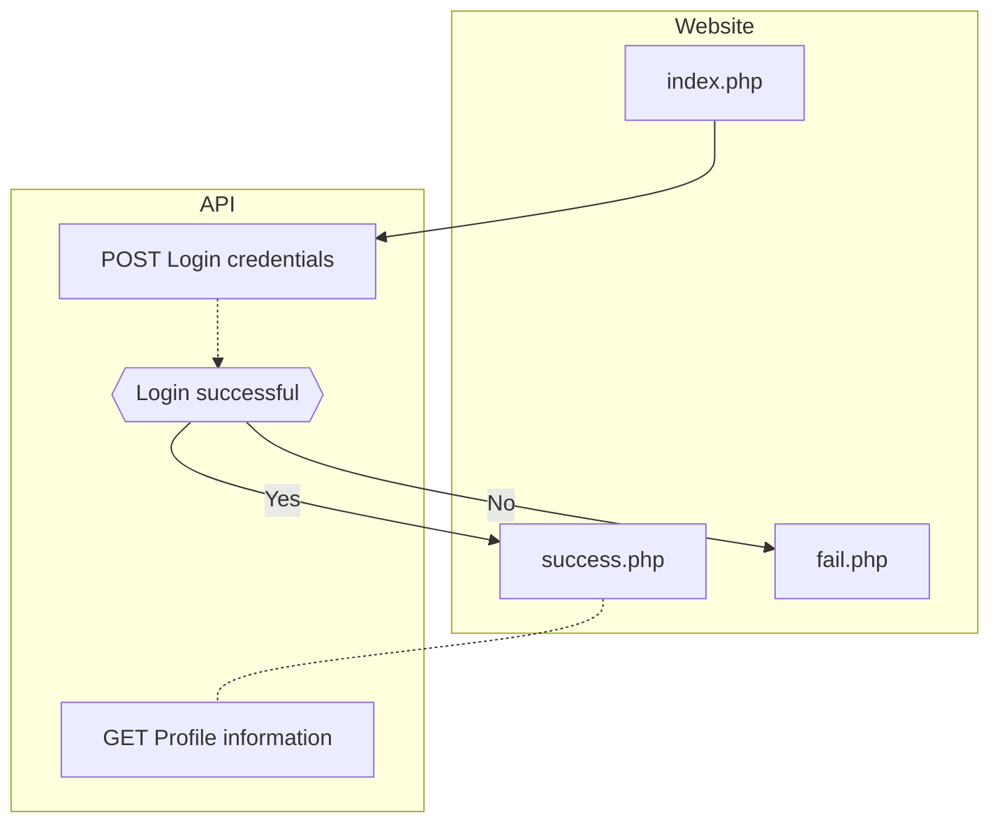

# Golfdashboard SSO

This repository shows an example on how to implement Golfdashboard SSO on your website.
The necessary credentials can be retrieved through [Golfspot](https://app.golfspot.io).

## Flow
To clearify how the flow is working, you can find it visualized below.

## Streamed SSO
A streamed SSO can also be configured. Then your webpage will be informed as to when a user signs in or out.
This way your webpage always will be up-to-date as to who has an active session. You may find an example in the `stream.php` file. An `auth_token` will be sent in the POST data which will contain the bearer token of the active user. When the `auth_token` is empty the user has signed out.
