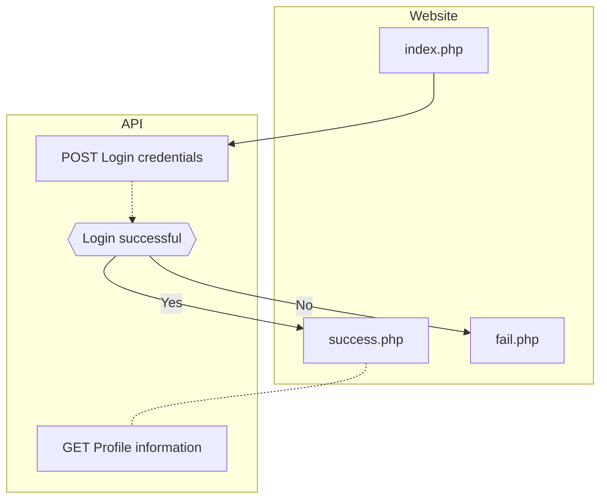

# Golfdashboard SSO

This repository shows an example on how to implement Golfdashboard SSO on your website.
The necessary credentials can be retrieved through [Golfspot](https://app.golfspot.io).

## Flow
To clearify how the flow is working, you can find it visualized below.

